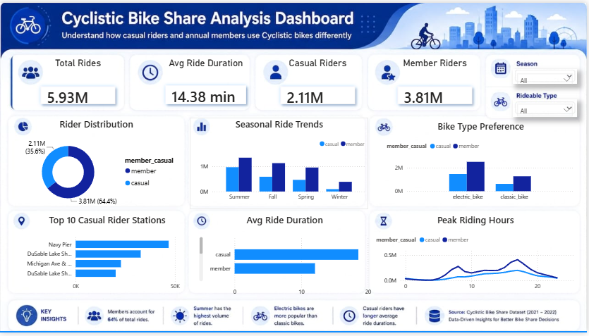

# 🚲 Cyclistic Bike Share Analysis

## 📊 Project Overview

This project analyzes Cyclistic bike-share usage to understand how **casual riders and annual members** use the service differently.

The analysis focuses on ride patterns, rider behavior, seasonal demand, bike preferences, popular stations, peak riding hours, and ride duration.

## 🎯 Business Objective

The goal is to identify differences between casual riders and annual members and generate insights that can help Cyclistic encourage casual riders to become annual members.

## 🛠️ Tools Used

- 🐍 Python
- 🐼 Pandas
- 📊 Power BI

## 🔄 Project Workflow

1. Collected and combined monthly Cyclistic trip datasets.
2. Cleaned and prepared the data using Python.
3. Converted date/time columns and handled missing values.
4. Created ride-duration and time-based features.
5. Analyzed rider behavior using Pandas.
6. Built an interactive Power BI dashboard.
7. Identified key business insights and recommendations.

## 📈 Dashboard

### Dashboard Features

- Total rides KPI
- Average ride duration
- Casual vs. member riders
- Rider distribution
- Seasonal ride trends
- Bike type preference
- Top 10 casual rider stations
- Peak riding hours
- Average ride duration by rider type
- Season and rideable-type filters

## 💡 Key Insights

- Casual riders recorded approximately **2.11 million rides**.
- Annual members recorded approximately **3.81 million rides**.
- **Summer** had the highest ride volume for both rider groups.
- Casual riders had a higher average ride duration than members.
- **Electric bikes** were more popular than classic bikes.
- Casual riders showed particularly high usage during the **afternoon and evening**, with 5 PM being the peak hour.

## 🎯 Business Recommendations

- Promote annual memberships to casual riders during the summer season.
- Target casual riders during afternoon and evening peak hours.
- Promote membership benefits at popular stations.
- Use electric-bike usage patterns when designing membership campaigns.
- Create targeted offers based on casual riders' longer ride durations.

## 📂 Project Files

| File | Description |
|------|-------------|
| `dashboard.png` | Power BI dashboard preview |
| `Cyclistic Bike Share Analysis.pdf` | Static PDF version of the dashboard |

## 📌 Conclusion

The analysis shows clear differences between casual riders and annual members in terms of ride frequency, duration, seasonality, bike preference, and riding hours.

These insights can help Cyclistic design targeted strategies to convert casual riders into annual members.

---

### 👩‍💻 Author

**Gowthami Kommineni**

B.Tech – Computer Science & Engineering (AI & ML)
